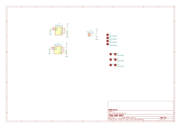

# USB distribution board

Double USB receptacle to power 5V usb devices out of your eurorack case.

Usefull for lamps, external sequencer or anything you need really.

Rated up to 3A, but make sure your PSU can handle your needs. 

Watch out when connecting the 5V and GND, as an inversion might damage/fry the equipment connected to the USB plugs.

## Schematics

## BoM

[See bom](documentation/bom/USB_distri_V1.0--iBoM.html)

## Build Informations

Solder first J3 (the terminal block), then put in place on J2 and J1 (the USB receptacles). Fasten the standoffs (use 12mm ones) between the front panel and the board, then solder J1 and J2 once everything is properly aligned.

## Images

